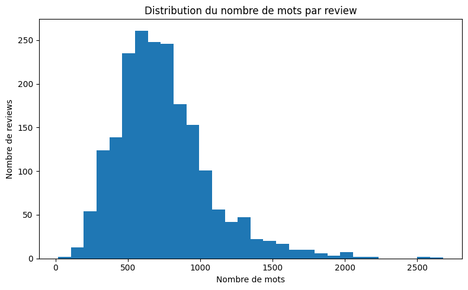
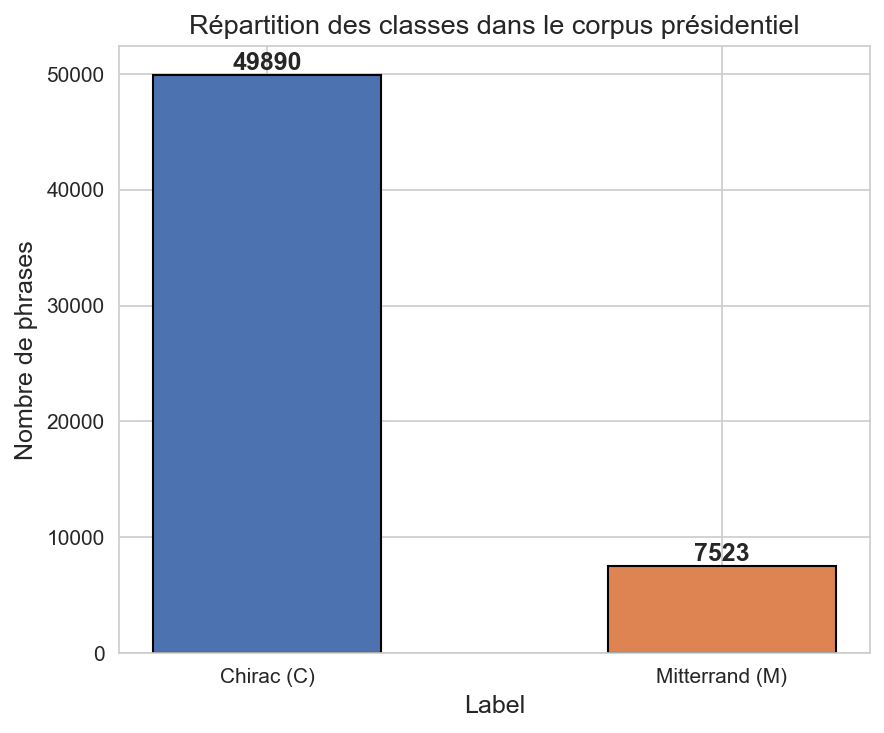
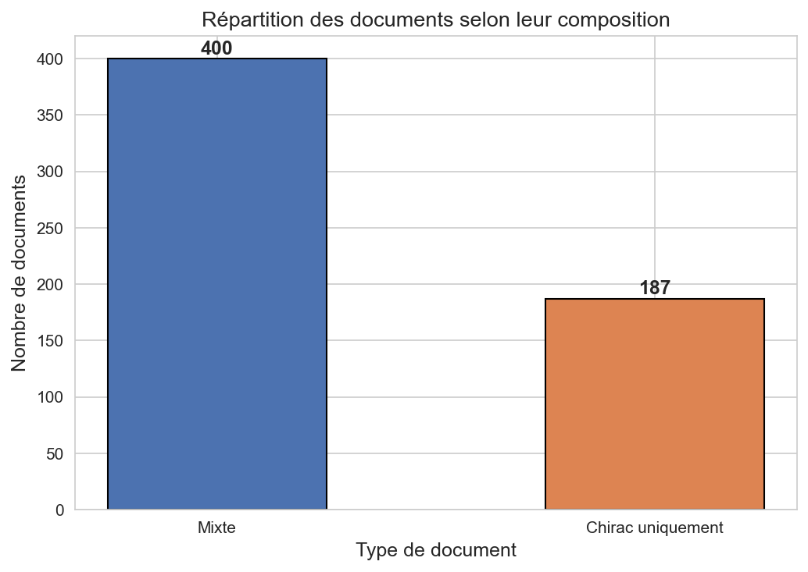

# NLP Text Classification: Sentiment Analysis & Speaker Attribution

Two supervised text classification tasks, each taken from a simple baseline to a tuned Transformer system:

| Task | Data | Best system | Hidden test set |
|---|---|---|---|
| **Sentiment analysis** of movie reviews (positive / negative) | 2,000 long English reviews (`movies1000`) | Weighted ensemble: TF-IDF SVM + two *head+tail* Twitter-RoBERTa models | **F1 = 93.1** |
| **Speaker attribution** of French political speeches (Chirac / Mitterrand) | 57,413 sentences from 587 documents, 87% / 13% | CamemBERT-large trained on speaker-homogeneous chunks, predicting each sentence inside its document context | **F1 = 86.9** (Mitterrand class) |

> 🎓 Course project for **RITAL** (Information Retrieval & NLP), Sorbonne Université, 2025–2026
> Team: **Wafaa Berrais** & **Zineddine Mohammedi** · Full report (French): [`docs/tal-rapport.pdf`](docs/tal-rapport.pdf)

---

## 1. Sentiment analysis of movie reviews

**Challenge.** The reviews are long: 746 words on average and up to 2,678. Standard Transformers read at most 512 tokens, so a plain model only sees the beginning of most reviews. Yet the reviewer's final verdict often comes at the end.

<p align="center">
  
  <br/><em>Number of words per review. Most reviews are longer than a 512-token Transformer window.</em>
</p>

**Approach**

1. **EDA:** class balance, review lengths, frequent words and word clouds per class.
2. **TF-IDF baselines:** Naive Bayes, Logistic Regression and LinearSVC.
3. **SVM tuning:** word and char n-grams, LSA and a hyperparameter search. The final setting is word 1–2-grams, `min_df=3`, `sublinear_tf` and `C=5`.
4. **Neural models:** FastText, DistilBERT and BERT.
5. **Sentiment-specialised Transformer:** `cardiffnlp/twitter-roberta-base-sentiment-latest`, fine-tuned for 3 epochs with lr 2e-5.
6. **Long-text handling, driven by error analysis:** the *head+tail* strategy keeps the first and last tokens of each review (256+256 or 384+128) instead of truncating the end.
7. **Ensembles:** a weighted soft vote `SVM (2.0) + RoBERTa 256/256 (0.5) + RoBERTa 384/128 (0.5)`, with the decision threshold tuned to 0.52.

**Results**

| Model | Validation F1 | Test F1 (platform) |
|---|---:|---:|
| FastText | 0.870 | 76.5 |
| TF-IDF + LinearSVC (tuned) | 0.894 | 83.4 |
| DistilBERT / BERT | 0.836 / 0.857 | – |
| Twitter-RoBERTa (standard truncation) | 0.910 | 91.7 |
| Twitter-RoBERTa **head+tail 256/256** | 0.944 | 92.8 |
| **Final ensemble (SVM + 2 × RoBERTa head+tail)** | **0.965** | **93.1** |

The validation set is a stratified 20% split (400 reviews). The test scores come from the course's evaluation platform, which uses hidden labels.

**Takeaways.** A well-tuned linear SVM is a strong baseline, but a sentiment-specialised Transformer does clearly better. The largest single gain came from **fixing truncation** with head+tail. The final ensemble works because its members are complementary: the SVM captures global lexical cues, while RoBERTa captures context.

## 2. Speaker attribution: Chirac or Mitterrand?

**Challenge.** Each sentence must be attributed to Jacques Chirac or François Mitterrand, but:

- **the classes are heavily imbalanced:** 86.9% of the sentences are Chirac's and 13.1% are Mitterrand's;
- **68% of the documents are mixed.** No document contains only Mitterrand, and mixed documents switch speaker up to two times, so the neighbouring sentences can belong to the other speaker;
- sentences are short (21 words on average), so a single sentence carries little stylistic signal.

<p align="center">
  
  
</p>

**Approach**

1. **Split by document** *before* building any training example, so that sentences from the same speech never appear in both train and test (no leakage).
2. **Training on speaker-homogeneous chunks** of consecutive sentences (up to 250 words), rather than on isolated sentences, to give the model enough stylistic signal.
3. **Contextual prediction:** at test time, each sentence is classified inside a context window of the surrounding text (250 words).
4. **Model:** fine-tuned `camembert/camembert-large`.
5. **Variants explored:** class-weighted loss with early stopping, longer chunks (350 words), frontier-aware chunking near speaker changes, and context window sizes from 120 to 350 words.
6. **Error analysis:** errors concentrate in mixed documents and near speaker transitions.

**Results** (sentence-level local test set, document-disjoint; precision, recall and F1 are for the minority class, Mitterrand)

| Configuration | Accuracy | Precision | Recall | F1 | Macro-F1 |
|---|---:|---:|---:|---:|---:|
| **Chunks 250 words + context 250** | 0.956 | 0.824 | 0.828 | **0.826** | **0.900** |
| Chunks 350 words + context 250 | 0.957 | 0.850 | 0.801 | 0.825 | 0.900 |
| Frontier-aware chunks + context 250 | 0.957 | 0.887 | 0.762 | 0.820 | 0.898 |
| Weighted loss + early stopping | 0.949 | 0.845 | 0.760 | 0.800 | – |

The best submission on the hidden test set reached **F1 = 86.9** (precision 78.1, recall 96.8).

**Takeaways.** Respecting the document structure mattered more than any other choice: the document-level split, the homogeneous training chunks and the contextual inference. Among the variants, some traded recall for precision, and the 250/250 configuration gave the best balance on the minority class.

## Repository structure

```text
.
├── sentiment/
│   ├── 01_eda.ipynb
│   ├── 02_tfidf_baselines.ipynb
│   ├── 03_svm_tuning.ipynb
│   ├── 04_fasttext_distilbert_bert.ipynb
│   ├── 05_twitter_roberta.ipynb
│   ├── 06_simple_ensemble_svm_roberta.ipynb
│   ├── 07_head_tail_roberta.ipynb
│   ├── 08_tuning_deberta_vote.ipynb
│   └── 09_final_ensemble_submissions.ipynb      # final system
├── authorship/
│   ├── 01_context_chunks_camembert.ipynb
│   ├── 02_weighted_loss_early_stopping.ipynb
│   ├── 03_speaker_boundaries.ipynb
│   ├── 04_error_analysis.ipynb
│   ├── 05_final_comparison.ipynb                # final comparison of configurations
│   ├── 06_final_retrain_submission.ipynb        # retrain best model + test predictions
│   └── experimental/two_pass_test_unfinished.ipynb
├── data/README.md                                # where to get the corpora
├── docs/
│   ├── tal-rapport.pdf                           # full report (French)
│   └── figures/
└── requirements.txt
```

## Running the notebooks

The notebooks were developed on **Google Colab with a GPU** (CamemBERT-large and RoBERTa fine-tuning). They are saved with their outputs, so the results can be read directly on GitHub. To re-run them:

1. Get the data as described in [`data/README.md`](data/README.md).
2. Open a notebook in Colab (or locally with a GPU), then run `pip install -r requirements.txt`.
3. Update the data and output paths in the first cells. They currently point to Google Drive.

The notebooks' comments and markdown are in French.

## Tech stack

Python · PyTorch · Hugging Face Transformers & Datasets · scikit-learn · FastText · NLTK · pandas · Matplotlib · Google Colab (GPU)

## Authors

- **Wafaa Berrais** · [@wafaaBerrais](https://github.com/wafaaBerrais)
- **Zineddine Mohammedi**
